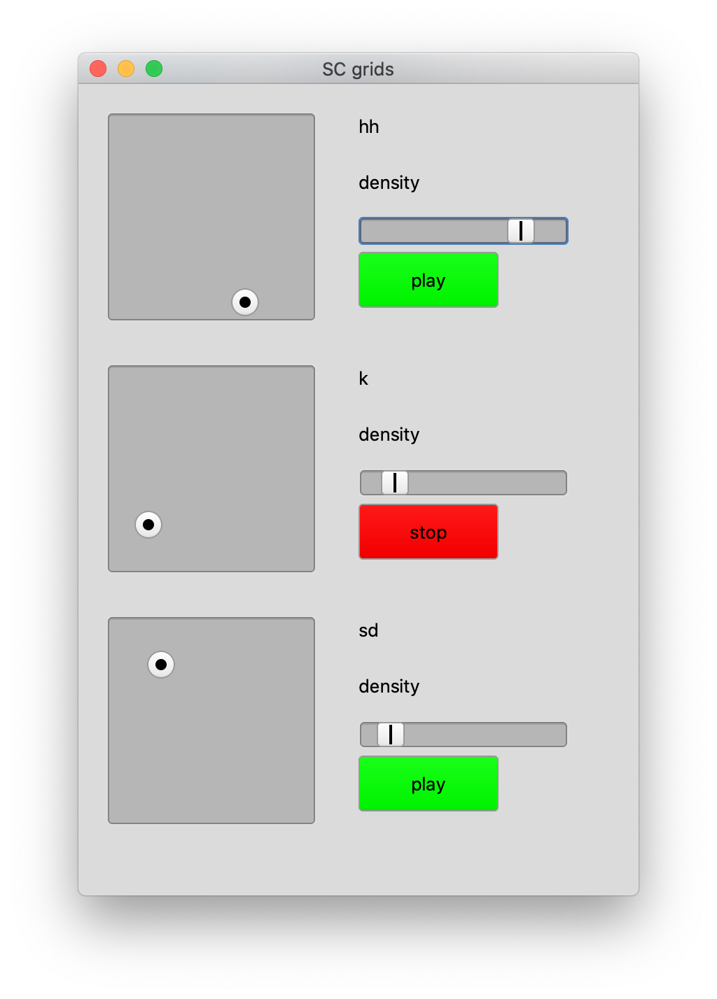

# SuperCollider Grids

[SuperCollider](https://supercollider.github.io/) port of the Eurorack module [*Grids*](https://mutable-instruments.net/modules/grids/manual/) by [*Mutable Instruments*](https://mutable-instruments.net/).
This port was made possible because the [source code for *Grids*](https://github.com/pichenettes/eurorack/tree/master/grids) is open source.

## GUI

To somehow mimic the haptic feedback of this module there is a GUI implementation which controls multiple `TDefs`.

For the source code of this take a look at the `grids_gui.scd`.
